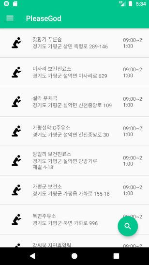
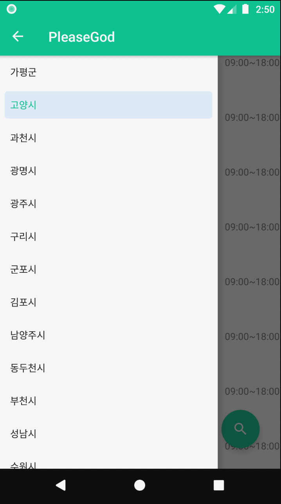
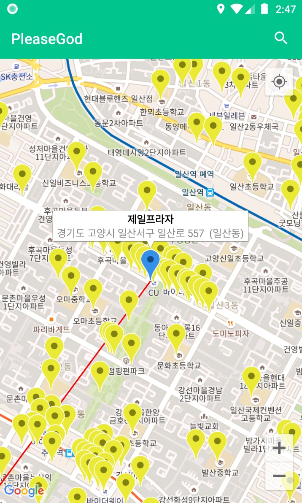
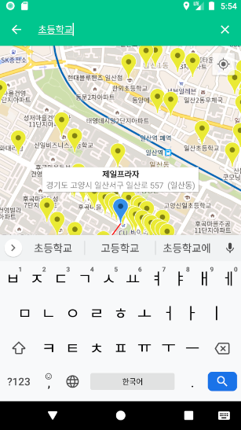

# PleaseGod
경기도 안의 현재 위치/지역 기반 공중, 개방 화장실 위치를 확인 할 수 있는 안드로이드 앱 입니다.

## 사용된 라이브러리
- RxJava2(https://github.com/ReactiveX/RxJava)
- RxAndroid(https://github.com/ReactiveX/RxAndroid)
- Retrofit2(https://github.com/square/retrofit)
- Glide(https://github.com/bumptech/glide)
- MaterialDrawer(https://github.com/mikepenz/MaterialDrawer)
- MaterialSearchView(https://github.com/MiguelCatalan/MaterialSearchView)

## Screenshots

